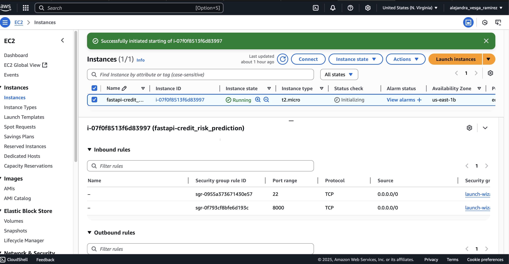
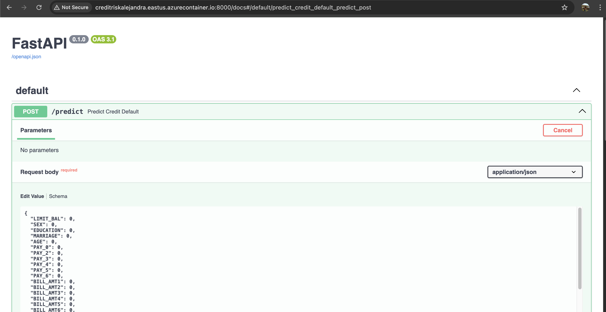

# Credit Risk Prediction API

This project exposes a credit risk prediction model as an API using FastAPI.

## 🧠 What it does

- Trains a `RandomForestClassifier` to predict credit default.
- Saves the model and scaler as `.joblib` files.
- Exposes a `/predict` endpoint using FastAPI.
- Includes separate modules for preprocessing, training, and evaluation.

---

## 📁 Project structure

```
Credit-Risk-Prediction/
├── data/
│   └── default_of_credit_card_clients.csv
├── models/
│   ├── rf_model.joblib
│   └── scaler.joblib
├── src/
│   ├── main.py
│   ├── pipeline.py
│   ├── train.py
│   ├── preprocessing.py
│   └── evaluate.py
├── requirements.txt
├── docs/
│   ├── image_deployment.png
│   ├── Screenshot_port8000.png
│   ├── Screenshot_server_running.png
└── README.md
```

---

## ⚙️ Setup instructions (local)

### 1. Clone the repository

```bash
git clone https://github.com/AlejandraRocks/Credit-Risk-Prediction.git
cd Credit-Risk-Prediction
```

### 2. Create a virtual environment

```bash
python3 -m venv venv
source venv/bin/activate
```

### 3. Install dependencies

```bash
pip install --break-system-packages -r requirements.txt
```

---

## 🚀 Train the model

```bash
python3 src/pipeline.py
```

This generates:

- `models/rf_model.joblib`
- `models/scaler.joblib`

---

## 🌐 Run the API with FastAPI

```bash
uvicorn src.main:app --host 0.0.0.0 --port 8000 --reload
```

Documentation available at:

- [http://localhost:8000/docs](http://localhost:8000/docs)

---

## 📥 JSON example for `/predict`

```json
{
  "LIMIT_BAL": 20000,
  "SEX": 2,
  "EDUCATION": 2,
  "MARRIAGE": 1,
  "AGE": 24,
  ...
  "PAY_AMT6": 0
}
```

Expected response:

```json
{
  "default_prediction": 0
}
```

---

## 📷 Deployment on AWS EC2

The API was successfully deployed on an EC2 Ubuntu 24.04 instance using Uvicorn on port 8000.

- ✅ **Instance running**:

  

- ✅ **Security Group with ports 22 and 8000 enabled**:

  

- ✅ **FastAPI accessible from browser**:

  

---


## ☁️ Deployment on Azure (ACI + ACR)

This app was containerized with Docker and deployed using:

- Azure Container Registry (ACR)
- Azure Container Instances (ACI)

📄 Full steps in [`docs/DEPLOYMENT.md`](docs/DEPLOYMENT.md)

Preview:  
  


---


## 👩‍💻 Author

Alejandra Vesga-Ramírez  
[LinkedIn](https://www.linkedin.com/in/alejandravesgaramirez)

---

## 📝 License

MIT License. See `LICENSE` file for details.