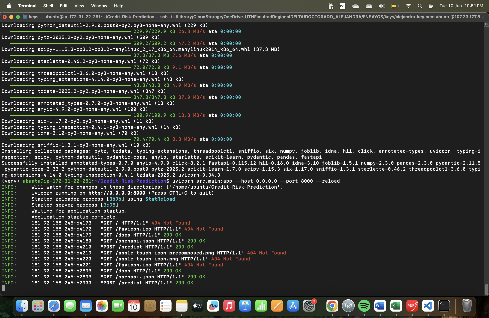
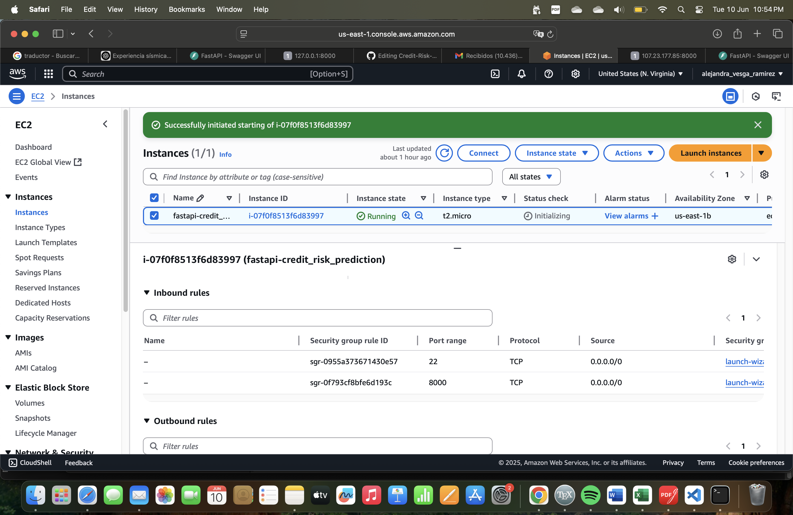
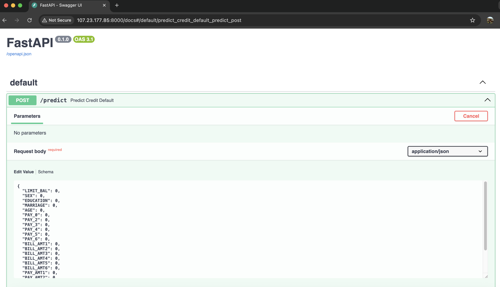
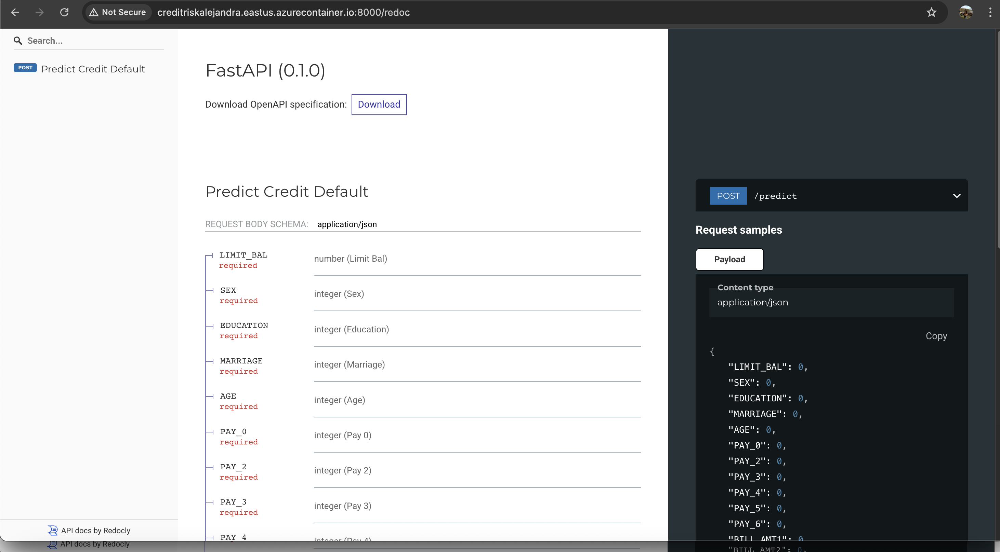
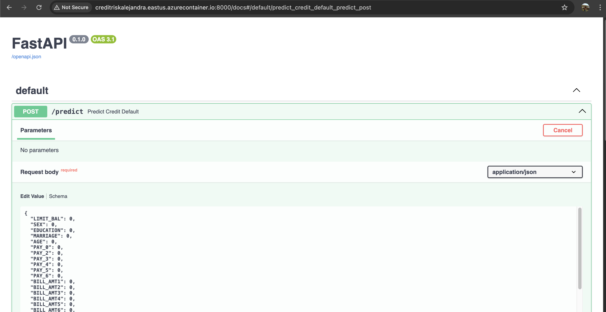

# 🚀 Deployment Guide

This guide documents how the `Credit-Risk-Prediction` FastAPI application was deployed on both **AWS EC2** and **Azure Container Instances (ACI)**.

---

## 🟢 Deployment on AWS EC2

The API was successfully deployed on an EC2 Ubuntu 24.04 instance using Uvicorn on port 8000.

- ✅ **Instance running**:

  

- ✅ **Security Group with ports 22 and 8000 enabled**:

  

- ✅ **FastAPI accessible from browser**:

  

---

## 🔵 Deployment on Azure Container Instances (ACI)

The `Credit-Risk-Prediction` FastAPI application was also deployed using **Azure Container Instances (ACI)**. The process involved building and pushing a Docker image to an **Azure Container Registry (ACR)** and launching the app via the Azure CLI.

---

### 🐳 Step 1: Build and Tag Docker Image

```bash
docker build -t credit-risk-app .
docker tag credit-risk-app alejandravesgaregistry.azurecr.io/credit-risk-app
```

---

### 🔐 Step 2: Push Docker Image to Azure Container Registry (ACR)

```bash
az acr login --name alejandravesgaregistry
docker push alejandravesgaregistry.azurecr.io/credit-risk-app
```

---

### ☁️ Step 3: Deploy Container to Azure

```bash
az container create \
  --resource-group myResourceGroup \
  --name credit-risk-app \
  --image alejandravesgaregistry.azurecr.io/credit-risk-app \
  --cpu 1 \
  --memory 1 \
  --registry-login-server alejandravesgaregistry.azurecr.io \
  --registry-username alejandravesgaregistry \
  --registry-password YOUR_PASSWORD_HERE \
  --ports 8000 \
  --dns-name-label creditriskalejandra \
  --location eastus \
  --os-type Linux
```

✅ You can then access the app at:

```text
http://creditriskalejandra.eastus.azurecontainer.io:8000
```

---

### 🖼️ Azure Deployment Screenshots

- **ACI Container Running**:

  

- **FastAPI Accessible on Azure**:

  

---
